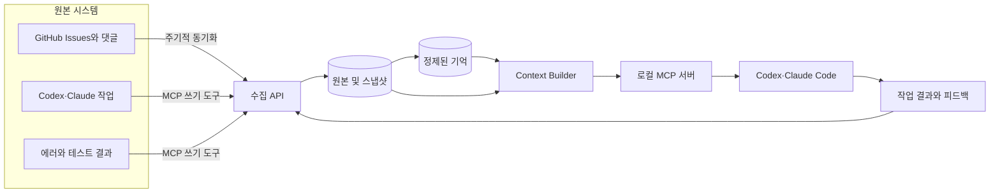

# 전체 아키텍처

## 목적

Second Brain은 다음 세 가지를 가능하게 하는 시스템입니다.

1. GitHub Issues에 기록한 학습 내용을 AI가 작업 중 검색할 수 있습니다.
2. 사용자의 확정된 결정과 선호를 다음 작업에 재사용합니다.
3. 과거 에러, 실패한 접근, 검증된 해결법을 유사 상황에서 다시 제공합니다.

장기적으로는 사용자가 자리를 비운 상황에서도 AI가 기존 결정과 안전 정책을 참고해 제한된 작업을 수행할 수 있어야 합니다.

## 설계 원칙

### 원본과 기억을 분리합니다

GitHub Issue, AI 대화, 에러 로그와 작업 실행 기록은 원본입니다. 요약, 결정, 선호, 실패 사례는 원본에서 파생된 기억입니다.

파생 기억이 잘못되더라도 원본에서 다시 생성할 수 있어야 합니다.

### 모든 기억에는 근거가 있어야 합니다

AI가 사용하는 기억은 원본 Issue, 대화 세션, 사용자 메시지 또는 검증된 작업 실행으로 돌아갈 수 있어야 합니다.

### 필요한 정보만 전달합니다

DB 전체나 과거 대화 전체를 AI의 프롬프트에 넣지 않습니다. 현재 저장소와 작업에 관련된 작은 Context Pack만 제공합니다.

### 무료로 시작합니다

첫 번째 버전은 다음 무료 범위 안에서 동작하도록 설계합니다.

- GitHub Actions 기본 제공량
- Supabase Free
- 로컬에서 실행되는 MCP 서버
- PostgreSQL 구조화 필터와 문자열 검색
- 현재 사용 중인 Codex 또는 Claude 세션을 통한 기억 구조화

별도의 백그라운드 AI API와 항상 실행되는 서버는 사용하지 않습니다.

### 모듈형 모놀리스로 시작합니다

수집, 기억 처리, 검색, MCP 기능의 경계는 나누지만 처음부터 여러 서버나 데이터베이스로 분리하지 않습니다.

## 시스템 구성



## 주요 구성 요소

### GitHub 동기화

GitHub Actions가 변경된 Issue와 댓글을 조회하여 수집 API에 전달합니다.

- 6시간마다 증분 동기화
- 주 1회 전체 정합성 확인
- 필요할 때 수동 동기화
- `repository_id + issue_number`를 고유 식별자로 사용
- `content_hash`가 달라진 데이터만 새 버전으로 저장
- 마지막 동기화 시점보다 조금 이전부터 다시 조회하여 누락 방지

GitHub가 학습 Issue의 Source of Truth입니다. DB에 저장된 Issue 본문은 검색용 복제본이며 GitHub와 별도로 수정하지 않습니다.

### 수집 API

모든 데이터가 들어오는 공통 진입점입니다.

- 요청 인증
- 입력 검증
- 중복 제거
- 민감정보 검사
- 원본 이벤트와 스냅샷 저장
- 정제된 기억의 생성 및 상태 변경
- 감사 로그 기록

GitHub Actions와 로컬 MCP 서버가 DB 관리자 키를 직접 사용하지 않도록 이 경계를 둡니다.

### 원본 저장소

외부에서 받은 데이터를 가능한 한 원래 형태로 저장합니다.

- GitHub Issue와 댓글
- 기억을 생성하게 된 사용자 메시지의 참조
- AI 작업 목표와 결과
- 실패 증상과 실행 결과
- 데이터 변경 스냅샷
- 수집 및 MCP 도구 호출 감사 기록

AI 대화 전문 자동 저장은 MVP 범위에 포함하지 않습니다.

### 기억 저장소

AI가 다음 작업에서 직접 활용할 수 있도록 정리된 정보를 저장합니다.

- 학습 지식
- 결정
- 선호
- 실패 사례
- 반복 절차
- 프로젝트 제약

기억은 적용 범위, 상태, 출처와 유효 기간을 가집니다.

### Context Builder

현재 작업에 관련된 기억을 선택하고 우선순위를 정합니다.

1. 현재 사용자의 명시적 지시
2. 현재 작업과 경로에 적용되는 기억
3. 같은 프로젝트와 저장소의 확정된 기억
4. 전역 기억
5. 관련 학습 기록과 실패 사례

충돌한 기억은 임의로 하나를 선택하지 않고 충돌 목록으로 반환합니다.

### 로컬 MCP 서버

Codex와 Claude Code가 공통으로 사용하는 기억 인터페이스입니다.

- 에이전트 실행 시에만 로컬 프로세스로 시작
- 읽기와 쓰기 도구 분리
- 쓰기 작업은 항상 감사 로그에 기록
- DB 구조를 에이전트에 직접 노출하지 않음
- 수집 API를 통해 데이터 조회 및 변경

## 식별과 적용 범위

프로젝트를 로컬 경로만으로 식별하지 않습니다.

```text
GitHub repository_id
    ├─ repository name과 URL
    ├─ 로컬 checkout 경로
    ├─ worktree 경로
    └─ 저장소 내부 project 및 path
```

저장소 이름이나 로컬 경로가 변경되어도 같은 기억을 찾을 수 있도록 안정적인 GitHub ID를 기준으로 사용합니다.

## 장애 시 동작

- MCP 연결에 실패하면 AI는 기억을 읽었다고 가정하지 않습니다.
- 기존 결정이 필요한 중요한 작업이라면 사용자에게 확인합니다.
- 기억 저장에 실패하면 현재 작업을 무조건 성공으로 기록하지 않습니다.
- GitHub 동기화 실패는 다음 실행에서 재시도합니다.
- 중복 요청이 들어와도 같은 결과가 되도록 멱등성을 유지합니다.

## 향후 자율 실행

자율 실행은 기억 시스템이 안정된 뒤 별도의 계층으로 추가합니다.

```text
작업 큐
→ Context Pack
→ 권한 및 위험도 판단
→ AI 작업
→ 테스트와 검증
→ 허용 범위 안에서 결과 반영
→ 감사 기록
```

배포, DB 변경, 외부 메시지, 비용 발생, 복구하기 어려운 작업은 별도의 승인 정책이 필요합니다.
