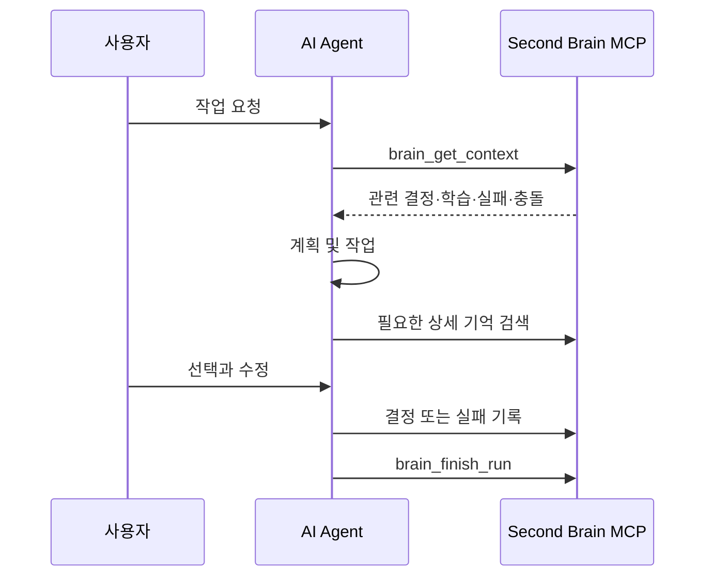

# Context 및 MCP 계약

## 목적

Context 계약은 AI에게 무엇을 언제 얼마나 제공할지 정의합니다. 목표는 많은 데이터를 전달하는 것이 아니라 현재 작업에 필요한 신뢰할 수 있는 정보를 제공하는 것입니다.

## 세션 흐름



## 초기 Context Pack

`brain_get_context`는 다음 구조를 반환합니다.

```json
{
  "repository": {
    "id": "github-repository-id",
    "name": "owner/repository"
  },
  "task": "현재 작업 설명",
  "constraints": [],
  "decisions": [],
  "preferences": [],
  "related_learning": [],
  "past_failures": [],
  "procedures": [],
  "conflicts": [],
  "sources": []
}
```

각 항목은 전체 원문이 아니라 짧은 문장, 상태, 적용 범위와 원본 ID를 제공합니다. AI는 상세 내용이 필요한 경우에만 `brain_get_detail`을 호출합니다.

## 크기 제한

초기 Context Pack은 다음을 기본값으로 합니다.

- 최대 약 3,000토큰
- 종류별 최대 5개
- 전체 최대 20개 기억
- 원본 전체 본문 제외
- 충돌과 안전 제약은 일반 학습 기록보다 우선

결과가 많으면 MCP 서버가 우선순위가 높은 항목만 반환하고 추가 검색이 가능하다는 사실을 표시합니다.

## 검색 우선순위

임베딩을 사용하지 않는 MVP에서는 다음 점수로 정렬합니다.

1. 같은 repository 및 project
2. 더 구체적인 scope
3. `verified` 또는 `confirmed` 상태
4. 태그와 검색어의 정확한 일치
5. 제목과 본문의 부분 일치
6. 최근 사용 및 유용성 평가
7. 최신 확인 시점

`superseded`, `deprecated`, `deleted` 기억은 일반 검색 결과에서 제외합니다. `proposed` 기억은 Memory Inbox 조회에서만 반환합니다.

## MCP 읽기 도구

### `brain_get_context`

현재 작업을 시작하기 위한 Context Pack을 반환합니다.

```text
입력
- repository 식별 정보
- 작업 설명
- 관련 경로
- 선택적 태그

출력
- Context Pack
- 충돌 목록
- 추가 검색 필요 여부
```

### `brain_search`

기억 종류와 범위를 지정하여 검색합니다.

```text
입력
- query
- kinds
- scopes
- statuses
- limit

출력
- 짧은 검색 결과
- 상태와 적용 범위
- 원본 참조
```

### `brain_get_detail`

선택한 기억의 상세 내용과 근거를 반환합니다.

```text
입력
- memory_id

출력
- 전체 기억
- 원본 참조
- 대체된 기억 관계
- 사용 및 검증 이력
```

## MCP 쓰기 도구

### `brain_save_decision`

사용자의 확정된 선택 또는 AI가 제안한 결정을 저장합니다.

사용자가 명시적으로 확정하지 않았다면 `proposed` 상태만 허용합니다.

### `brain_save_failure`

증상, 시도, 원인 또는 가설, 해결법과 검증 상태를 저장합니다.

원인이 확인되지 않았으면 `hypothesis` 또는 `investigating`으로 기록합니다.

### `brain_finish_run`

작업 목표, 결과, 변경 사항, 검증, 사용한 기억과 생성한 기억을 기록합니다.

### `brain_confirm_memory`

Memory Inbox의 제안 기억을 사용자가 확인했을 때 `confirmed`로 바꿉니다.

### `brain_supersede_memory`

기존 기억을 새로운 기억으로 교체하고 변경 관계를 남깁니다.

### `brain_forget`

사용자가 기억 삭제를 요청하거나 민감정보가 발견됐을 때 사용합니다. 감사 이력과 실제 데이터 삭제 범위는 기억 정책을 따릅니다.

## 에이전트 사용 규칙

저장소의 지속 지침에는 다음 내용을 포함합니다.

```text
- 작업 계획을 확정하기 전에 brain_get_context를 호출한다.
- 중요한 기술 선택 전에 관련 결정과 실패 사례를 검색한다.
- 사용자가 명시적으로 확정한 선택만 confirmed로 저장한다.
- AI가 추론한 선호와 해결법은 proposed로 저장한다.
- 작업 완료 전에 brain_finish_run을 호출한다.
- 비밀번호, 키, 토큰과 개인정보는 저장하지 않는다.
- 기억 사이에 충돌이 있으면 임의로 해결하지 않는다.
```

Codex는 `AGENTS.md`를 사용합니다. Claude Code용 `CLAUDE.md`는 같은 규칙이 중복되지 않도록 `AGENTS.md`를 가져오도록 구성합니다.

## 사용자가 사용할 자연어

사용자는 MCP 도구 이름을 알 필요가 없습니다.

```text
“이 선택을 기억해줘.”
“이건 이 프로젝트에서만 적용해.”
“내 전역 선호로 저장해.”
“비슷한 실패 사례를 찾아봐.”
“방금 해결한 에러를 기록해.”
“최근 제안된 기억을 보여줘.”
“이 기억은 오래됐으니 새 결정으로 바꿔.”
“이번 작업을 기록하고 마무리해.”
```

## 장애 시 계약

- MCP에 연결하지 못하면 AI는 기억을 읽었다고 말하지 않습니다.
- Context Pack을 받지 못해도 안전한 읽기와 분석은 계속할 수 있습니다.
- 기존 결정이 필요한 변경은 사용자에게 확인합니다.
- 쓰기 실패를 성공으로 보고하지 않습니다.
- 실패한 기록은 재시도할 수 있도록 멱등성 키를 사용합니다.
