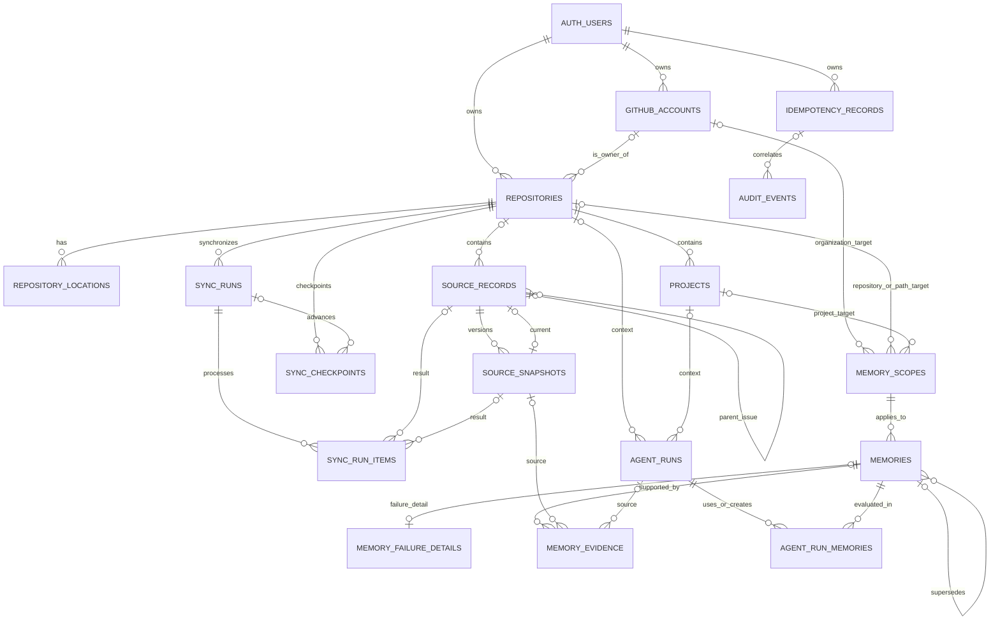

# 데이터베이스 스키마

## 목적과 범위

이 문서는 Second Brain MVP의 PostgreSQL/Supabase 데이터 모델과 DB 불변조건을 정의합니다.

초기 migration은
[`supabase/migrations/20260731000100_initial_schema.sql`](../supabase/migrations/20260731000100_initial_schema.sql)입니다.

이번 범위에 포함되는 것은 다음과 같습니다.

- GitHub 저장소 및 로컬 경로 식별
- 원본과 변경 스냅샷
- 기억, 적용 범위, 근거와 대체 관계
- 실패 기억의 상세 상태
- 에이전트 실행과 기억 피드백
- GitHub 동기화 상태
- 멱등성 및 감사 기록
- 소유자 단위 RLS, 최소 권한과 검색 인덱스

수집 API endpoint, GitHub 호출 방식과 MCP 도구 구현은 각 인터페이스 문서의 책임입니다.

## 핵심 결정

### 소유권

`auth.users.id`를 tenant 식별자인 `owner_id`로 사용합니다. 사용자 소유 데이터가 있는 모든 테이블은 `owner_id`를 직접 가집니다.

- RLS는 `owner_id = (select auth.uid())`만 평가합니다.
- `owner_id`가 포함된 composite foreign key로 다른 사용자의 행을 참조할 수 없게 합니다.
- RLS 조건의 선두 열이 `owner_id`인 인덱스를 둡니다.
- `anon` 역할에는 테이블 권한을 주지 않습니다.

현재 MVP는 개인용이지만 이 구조는 사용자별 격리를 유지하므로 같은 Supabase 프로젝트에 여러 사용자를 추가할 수 있습니다.

### 식별자

내부 primary key는 단일 PostgreSQL에서 쓰기 효율이 좋은 `bigint generated always as identity`를 사용합니다. 외부에 노출되는 멱등성 키, GitHub ID와 세션 ID는 별도 열에 저장합니다.

### 원본과 스냅샷

`source_records`는 외부 객체의 안정적인 정체성을, `source_snapshots`는 실제 변경 이력을 나타냅니다.

```text
source_records
  └─ source_snapshots
       └─ memory_evidence
            └─ memories
```

같은 `source_id + hash_version + content_hash`는 한 번만 저장됩니다. `current_snapshot_id`는 해당 source에 속한 snapshot만 가리킬 수 있습니다.

GitHub source의 외부 식별자는 다음 규칙을 사용합니다.

| source_type | external_id |
|---|---|
| `github_issue` | 저장소 안의 Issue number를 10진 문자열로 표현 |
| `github_comment` | GitHub comment database ID를 10진 문자열로 표현 |

저장소가 있는 source는 `(owner_id, repository_id, source_type, external_id)`로, 저장소가 없는 source는 `(owner_id, source_type, external_id)`로 유일합니다.

GitHub comment는 같은 repository의 `github_issue` source를 `parent_source_id`로 참조합니다. Issue database ID와 node ID는 각각 `provider_id`, `external_node_id`에 보존합니다.

reconcile에서 원격 항목이 보이지 않을 때 source는 다음 상태를 거칩니다.

```text
active
→ missing_candidate
→ deleted
```

두 번의 완전한 reconcile에서 연속으로 누락되어야 `deleted` tombstone이 됩니다. `source_records`는 연속 누락 횟수, 최초 누락 시각, 판정 sync run과 redaction된 tombstone metadata를 구조화된 열로 보존합니다.

### 기억의 근거

기억의 출처는 `memories`에 문자열로 중복 저장하지 않고 `memory_evidence`로 정규화합니다. 근거는 정확히 다음 중 하나를 참조합니다.

- `source_snapshots`
- `agent_runs`

`deleted`가 아닌 모든 기억에는 최소 한 개의 근거가 있어야 합니다. 이 조건은 deferred constraint trigger로 commit 시점에 검사하므로 기억과 근거를 반드시 같은 transaction에서 기록해야 합니다.

완전 삭제 시에는 기억 본문과 failure 상세를 `[deleted]` 형태로 비식별화하고 `memory_evidence`를 제거합니다. 따라서 삭제된 기억에서 source snapshot이나 excerpt로 다시 이동할 수 없고, 삭제 사실과 대상 ID만 `audit_events`에 남습니다.

### 범위

`memory_scopes`는 범위를 first-class entity로 관리합니다.

| scope_type | 필수 대상 |
|---|---|
| `global` | 없음 |
| `organization` | GitHub organization |
| `repository` | repository |
| `project` | project |
| `path` | repository와 저장소 상대 경로 |
| `task` | 호출자가 정한 안정적인 task key |

범위 형태는 check constraint로 고정되고 `scope_key`는 target에서 자동 생성됩니다. 같은 owner에게 동일한 범위 행은 하나만 존재합니다.

### 기억 대체

신규 기억의 `supersedes_id`가 이전 기억을 가리킵니다. 이전 기억의 successor는 역방향 조회로 찾으므로 별도 `superseded_by` 열을 두지 않습니다.

- 같은 `kind`와 같은 `scope_id` 안에서만 대체할 수 있습니다.
- 한 기억에는 successor가 하나만 존재할 수 있습니다.
- 자기 자신을 대체하거나 cycle을 만들 수 없습니다.
- AI의 `proposed` successor는 기존 기억을 비활성화하지 않습니다.
- successor가 `confirmed` 또는 `verified`가 되는 transaction에서 predecessor가 `superseded`가 되어야 합니다.
- 이전 기억을 `superseded`로 바꾸고 신규 기억 및 근거를 추가하는 작업은 하나의 transaction이어야 합니다.

`memories.revision`은 의미 있는 기억 필드가 바뀔 때 DB trigger가 증가시킵니다. API는 `WHERE revision = :expected_revision` 형태로 optimistic concurrency를 적용합니다.

### 실패 기억

공통 검색 필드는 `memories`에, 실패 전용 필드는 `memory_failure_details`에 둡니다.

```text
memory.kind = failure
  └─ memory_failure_details
       ├─ resolution_status
       ├─ symptom
       ├─ context
       ├─ attempted_approaches
       ├─ cause
       ├─ resolution
       └─ verification
```

`failure` 기억에는 상세 행이 반드시 하나 있어야 하고 다른 기억 종류에는 상세 행을 추가할 수 없습니다. 이 조건도 commit 시점에 검사합니다.

## 관계도



`AUTH_USERS`는 migration이 생성하지 않는 Supabase `auth.users` 테이블입니다.

## 테이블 책임

| 테이블 | 책임 | 주요 유일성 |
|---|---|---|
| `github_accounts` | GitHub 사용자 또는 organization 식별 | owner + GitHub account ID |
| `repositories` | 안정적인 GitHub repository 식별 | owner + GitHub repository ID |
| `repository_locations` | checkout/worktree 경로 매핑 | owner + normalized path |
| `projects` | monorepo 내부 project | owner + repository + root path |
| `memory_scopes` | 기억 적용 범위 | owner + scope type + generated key |
| `sync_runs` | 동기화 한 번의 결과와 cursor 전후 상태 | 선택적 idempotency key |
| `sync_checkpoints` | repository stream별 마지막 성공 cursor | owner + repository + stream |
| `sync_run_items` | 항목별 accepted/duplicate/retry/quarantine 결과 | sync run + idempotency key |
| `source_records` | 외부 원본의 안정적인 정체성 | source identity |
| `source_snapshots` | 원본 변경 이력 | source + SHA-256 content hash |
| `agent_runs` | AI 작업 목표, 결과와 검증 | owner + idempotency key |
| `memories` | 재사용할 짧은 기억 | successor당 predecessor 하나 |
| `memory_failure_details` | failure 기억의 구조화된 상세 | memory당 하나 |
| `memory_evidence` | 기억과 근거의 연결 | memory + evidence |
| `agent_run_memories` | 실행에서 사용/생성된 기억과 피드백 | run + memory + relation |
| `idempotency_records` | mutation 요청 재생 및 key 오용 감지 | owner + actor + operation + key |
| `audit_events` | redaction된 읽기·쓰기·도구 호출 감사 | request ID로 연관 |

## 쓰기 transaction

### 원본 upsert

수집 API는 다음 단계를 하나의 transaction으로 실행합니다.

1. source identity로 `source_records`를 `INSERT ... ON CONFLICT` 처리합니다.
2. canonical payload의 `sha256:<lowercase-hex>` hash를 계산합니다.
3. `(source_id, hash_version, content_hash)` 충돌 시 snapshot insert를 생략합니다.
4. 신규 또는 기존 snapshot ID로 `current_snapshot_id`를 갱신합니다.
5. `last_seen_sync_run_id`와 sync count를 갱신합니다.
6. 성공한 전체 page 처리 후에만 `sync_checkpoints`를 전진시킵니다.

DB는 hash의 형식과 중복을 검증하지만 canonicalization 규칙은 API 계약에서 하나로 고정해야 합니다. hash 입력에는 Issue 제목·본문·상태·label·삭제 상태처럼 새 snapshot을 만들어야 하는 모든 필드를 포함해야 합니다.

### 기억 생성

다음 행은 하나의 transaction에서 commit되어야 합니다.

1. `memories`
2. `memory_failure_details` — `kind = failure`일 때만
3. 하나 이상의 `memory_evidence`
4. 실행 중 생성된 경우 `agent_run_memories(relation = created)`
5. `audit_events`

### 기억 대체

1. successor memory를 `supersedes_id = predecessor.id`로 생성합니다.
2. successor의 근거를 추가합니다.
3. predecessor를 `status = superseded`로 변경합니다.
4. 감사 event를 추가합니다.
5. 전체를 한 번에 commit합니다.

## 검색과 인덱스

MVP는 embedding 없이 구조화 필터와 문자열 검색을 사용합니다.

- `memories_context_lookup_idx`: owner, scope, kind와 활성 상태를 먼저 필터링
- `memories_inbox_idx`: `proposed` 기억만 최근 순서로 조회
- `memories_tags_gin_idx`: tag 배열 포함 검색
- `memories_search_trgm_idx`: statement와 rationale의 한국어 부분 일치
- `source_snapshots_search_trgm_idx`: 원본 제목과 내용의 부분 일치
- repository, source, run, evidence의 모든 foreign key lookup에 B-tree index

`pg_trgm`은 초기 migration에서 `extensions` schema에 설치합니다. 검색 query는 먼저 owner, scope, status를 제한하고 trigram 조건을 적용해야 합니다. 실제 데이터와 query가 생긴 뒤 `EXPLAIN (ANALYZE, BUFFERS)`로 임계값과 정렬식을 조정합니다.

## RLS와 권한

모든 사용자 데이터 테이블은 RLS와 `FORCE ROW LEVEL SECURITY`가 활성화됩니다.

```sql
owner_id = (select auth.uid())
```

권한은 다음처럼 제한합니다.

- `anon`: 모든 테이블 접근 거부
- `authenticated`: 자신의 행만 RLS를 통해 접근
- `source_snapshots`: `SELECT`, `INSERT`만 허용
- `audit_events`: `SELECT`, `INSERT`만 허용
- 그 밖의 mutable 테이블: 필요한 CRUD 허용

snapshot과 audit event는 일반 사용자 역할로 수정하거나 직접 삭제할 수 없습니다. 민감정보 완전 삭제는 source 또는 owner 삭제를 포함하는 별도의 승인된 transaction/RPC에서 파생 기억과 함께 처리해야 합니다.

GitHub Actions와 로컬 MCP에 `service_role` key를 전달하지 않습니다. B 트랙은 최종 인증 방식을 정할 때 사용자 JWT 전달 또는 제한된 server-side function 중 하나를 선택해야 합니다.

## 다른 트랙에 제공하는 계약

### B 트랙: 수집 API

- 모든 mutation은 인증된 `owner_id`를 가져야 합니다.
- client가 전달한 `owner_id`를 신뢰하지 않고 인증 정보에서 결정합니다.
- `idempotency_records.request_hash`는 `sha256:<lowercase-hex>` 형식입니다.
- 같은 operation/key에 다른 request hash가 오면 conflict로 처리합니다.
- 기억과 근거, failure 상세는 한 transaction에서 기록합니다.
- snapshot 및 audit payload에는 secret을 저장하기 전에 redaction을 적용합니다.

### C 트랙: GitHub와 MCP

- GitHub repository는 `github_repository_id`, Issue는 repository + number로 식별합니다.
- comment는 GitHub comment database ID를 사용합니다.
- checkpoint는 모든 page가 성공한 뒤 전진시킵니다.
- MCP의 `brain_get_detail`은 `memory_evidence`를 따라 snapshot 또는 run 근거를 반환합니다.
- `brain_finish_run`의 사용/생성 기억은 `agent_run_memories`에 저장합니다.
- AI가 추론한 기억은 `proposed`, 사용자가 확정한 기억만 `confirmed`입니다.

### D 트랙: 테스트

최소 두 사용자를 fixture로 만들어 다음을 검증해야 합니다.

- 다른 owner의 행은 조회·변경·참조할 수 없음
- 같은 snapshot 요청을 반복해도 snapshot이 추가되지 않음
- 근거 없는 기억과 상세 없는 failure 기억은 commit 실패
- 다른 kind/scope의 기억 대체와 cycle이 실패
- source snapshot과 audit event를 일반 역할로 수정할 수 없음
- checkpoint가 실패한 sync에서 전진하지 않음

## 후속 migration 원칙

- 적용된 migration 파일을 수정하지 않고 새 migration을 추가합니다.
- 새 foreign key에는 child-side index를 함께 추가합니다.
- enum 변경은 사용 중인 Supabase PostgreSQL 버전의 transaction 제약을 확인합니다.
- 큰 테이블의 constraint 추가는 `NOT VALID` 후 별도 `VALIDATE CONSTRAINT`를 고려합니다.
- 보존 기간, export 및 완전 삭제 RPC는 데이터가 생기기 전에 별도 migration으로 확정합니다.

## 검증

의존성 없는 정적 검사는 저장소 루트에서 실행합니다.

```text
node scripts/validate-db-schema.mjs
```

실제 PostgreSQL 계약 검증은 빈 테스트 DB에서 다음 순서로 실행합니다.

```text
psql -v ON_ERROR_STOP=1 -f supabase/tests/bootstrap.sql
psql -v ON_ERROR_STOP=1 -f supabase/migrations/20260731000100_initial_schema.sql
psql -v ON_ERROR_STOP=1 -f supabase/tests/schema_contract.sql
```

`bootstrap.sql`은 일반 PostgreSQL에 최소 Supabase auth 객체를 재현하는 테스트 전용 파일입니다. 실제 Supabase 프로젝트에는 이미 해당 역할과 `auth` schema가 있으므로 적용하지 않습니다.
